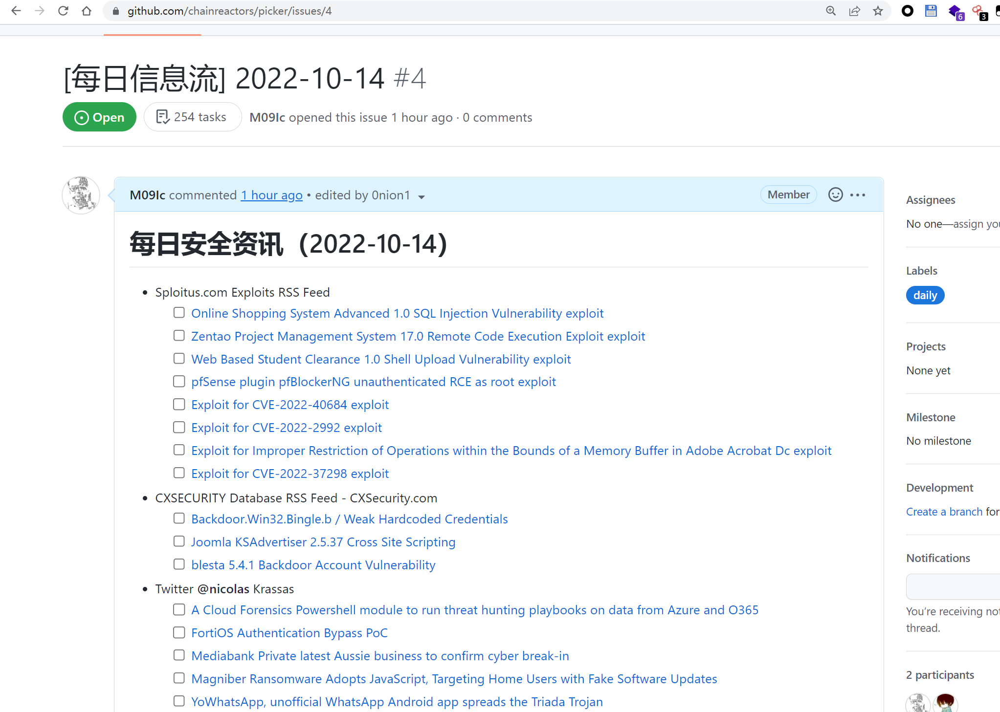
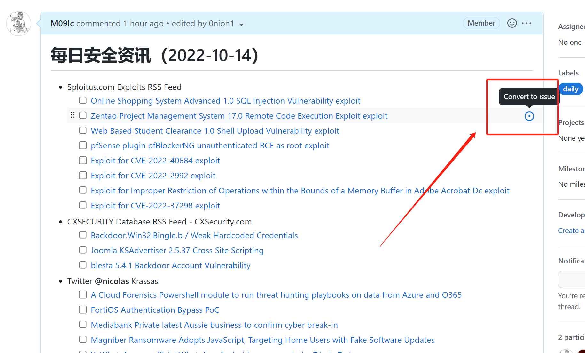
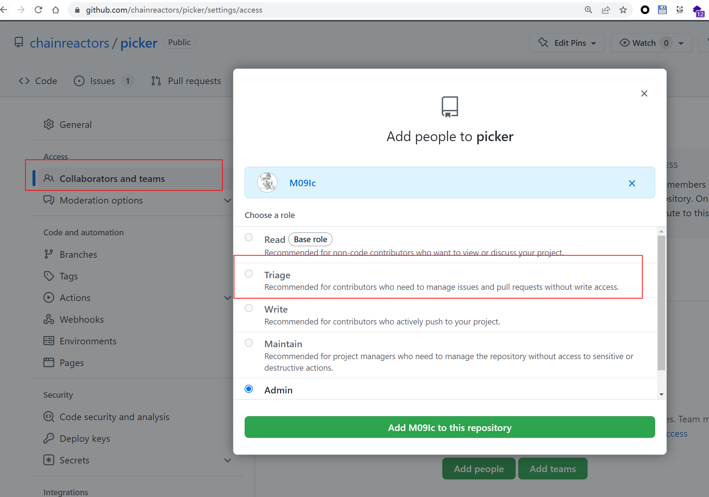
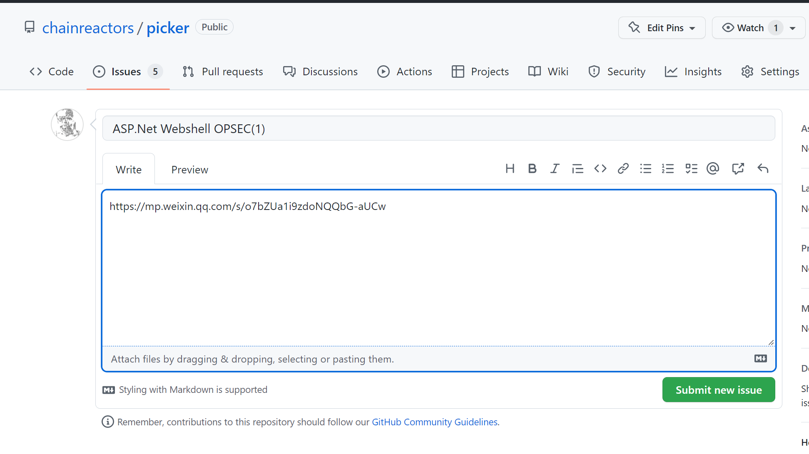
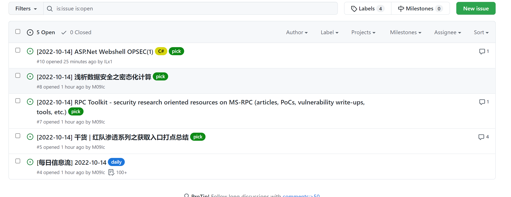

fork from https://github.com/VulnTotal-Team/yarb

# picker

抓取, 推送, 讨论, 交流, 互动为一体, 将 github 的 repo 变为私人的讨论社区。

支持导入 opml 文件，也可以订阅其他任何 RSS 源。

## 使用

基于 github action 实现的自动化推送系统

目前有四个不同的推送信息类型

- 每日信息流, 默认为每天早上 9 点 30 分推送昨天新增文章列表.
- 每日精选, 默认为每天下午 1 点半推送昨日精选
- 精选推送, 在每天生成的 issue 中, 点击 convert to issue 生成新的 issue 并推送到钉钉群
- 精选文章的评论区推送, 当有人评论了改文章, 自动推送到钉钉

### 信息流

每日会在 issue 中生成昨日信息流



### 精选

如果认为某篇文章质量较好, 值得其他人阅读可以点击 convert to issue 自动添加到精选文章列表.



如果需要多人合作, 普通的 read 权限并没有 convert to issue 的功能, 需要 triage 权限



或手动 new issue, 也会自动添加到 issue 中



每天下午 13:30, 会将昨日的精选汇总进行一次推送.

### 标签

每日信息流会自动添加标签 daily, 每日精选会自动添加标签 dailypick. 精选文章会添加标签 pick.

一些文章的细分领域可以通过手动添加不同的标签进行管理.



已经给主要用户都添加了写权限, 可以自行创建标签.

### 评论

对精选文章的评论将会自动推送到钉钉群

### 订阅源

推荐订阅源：

- [CustomRSS](rss/CustomRSS.opml)

其他订阅源：

- [CyberSecurityRSS](https://github.com/zer0yu/CyberSecurityRSS)
- [Chinese-Security-RSS](https://github.com/zhengjim/Chinese-Security-RSS)
- [awesome-security-feed](https://github.com/mrtouch93/awesome-security-feed)
- [SecurityRSS](https://github.com/Han0nly/SecurityRSS)
- [安全技术公众号](https://github.com/ttttmr/wechat2rss)
- [SecWiki 安全聚合](https://www.sec-wiki.com/opml/index)
- [Hacking8 安全信息流](https://i.hacking8.com/)

非安全订阅源：

- [中文独立博客列表](https://github.com/timqian/chinese-independent-blogs)

**添加自定义订阅源**

1. 在 `config.json` 中添加本地或远程仓库：

```yaml
rss:
  CustomRSS:
    enabled: true
    filename: CustomRSS.opml
  CyberSecurityRSS:
    enabled: true
    url: >-
      https://raw.githubusercontent.com/zer0yu/CyberSecurityRSS/master/CyberSecurityRSS.opml
    filename: CyberSecurityRSS.opml
  CyberSecurityRSS-tiny:
    enabled: false
    url: "https://raw.githubusercontent.com/zer0yu/CyberSecurityRSS/master/tiny.opml"
    filename: CyberSecurityRSS-tiny.opml
  Chinese-Security-RSS:
    enabled: true
    url: >-
      https://raw.githubusercontent.com/zhengjim/Chinese-Security-RSS/master/Chinese-Security-RSS.opml
    filename: Chinese-Security-RSS.opml
  awesome-security-feed:
    enabled: true
    url: >-
      https://raw.githubusercontent.com/mrtouch93/awesome-security-feed/main/security_feeds.opml
    filename: awesome-security-feed.opml
  SecurityRSS:
    enabled: true
    url: "https://github.com/Han0nly/SecurityRSS/blob/master/SecureRss.opml"
    filename: SecureRss.opml
  wechatRSS:
    enabled: true
    url: "https://wechat2rss.xlab.app/opml/sec.opml"
    filename: wechatRSS.opml
  chinese-independent-blogs:
    enabled: false
    url: >-
      https://raw.githubusercontent.com/timqian/chinese-independent-blogs/master/feed.opml
    filename: chinese-independent-blogs.opml
```

2.

自定义 rss 源位于`rss/CustomRSS.opml`中, 需要添加请提交 pr, 次日自动加入到推送列表

非 rss 源可以使用 rsshub 转发

## 部署

推荐使用 github action 部署

### github 部署

step1: fork 仓库

因为 fork 可能自动关闭 issue, 并且导致 issue 指向原仓库, 所以建议脱离 fork 关系. 操作比较简单, clone 本仓库, 然后创建一个空项目, 将该仓库 push 即可.

step2: 手动添加 label

**issue 需要通过标签管理, 所以需要先创建`pick`, `daily`与`dailypick`标签. 否则会报错**

step3: 创建 github token

在 secret 中配置`MY_GITHUB_TOKEN`, 点击这里[生成](https://github.com/settings/tokens/new), 只需要给 repo 权限即可.

step4: 配置 bot 机器人

当前只支持飞书,钉钉推送, 需要先[注册钉钉机器人](https://open.dingtalk.com/document/robots/custom-robot-access), 选择加签的方式.

在 github secret 中配置

- 钉钉机器人: `DINGTALK_KEY` , `DINGTALK_SECRET`, `PICKER_DINGTALK_KEY`, `PICKER_DINGTALK_SECRET`
- 飞书机器人: `PICKER_FEISHU_KEY`, `FEISHU_KEY`

可以配置两个不同的钉钉机器人, 也可以只配置一个, 如果只有一个所有消息均通过同一个机器人推送.

其他的推送渠道请自行添加, 可以参考 yarb 与 picker 中的代码, 修改下 markdown 模板即可实现.

### 本地搭建

需要在本地安装 github-cli ,并登录. 不推荐使用, 仅在调试模式下测试用.

```sh
$ git clone https://github.com/chainreactors/picker
$ cd picker && ./install.sh
```

编辑配置文件 `config.json`，启用所需的订阅源和机器人（key 也可以通过环境变量传入），最好启用代理。

```sh
$ ./picker.py --help
usage: picker.py [-h] [--update] [--cron CRON] [--config CONFIG] [--test]
optional arguments:
  -h, --help       show this help message and exit
  --update         Update RSS config file
  --cron CRON      Execute scheduled tasks every day (eg:"11:00")
  --config CONFIG  Use specified config file
  --test           Test bot

# 单次任务
$ ./picker.py
```
