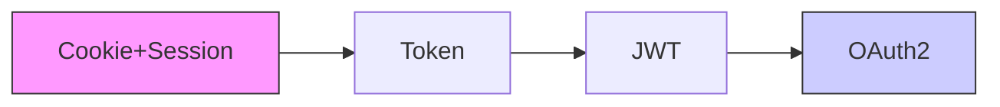

# 第13天-HTTP协议与身份鉴权技术全解析：红蓝队实战视角


# 第13天-HTTP协议与身份鉴权技术全解析：红蓝队实战视角

原创

萧瑶
萧瑶

Alfadi组织


在小说阅读器中沉浸阅读

深入理解Web通信基石，掌握攻防关键点

📘 一、HTTP协议核心基础

1. HTTP请求方法详解

```http

GET     - 获取资源（幂等）

POST    - 提交数据（非幂等）

PUT     - 更新资源（幂等）

DELETE  - 删除资源

HEAD    - 获取响应头

OPTIONS - 查看服务器支持的方法

TRACE   - 回显请求（用于诊断）

CONNECT - 建立隧道连接（用于代理）

```

幂等性区分：PUT与POST的核心差异在于，PUT多次执行结果一致，而POST每次可能创建新资源。

2. HTTP状态码分类精解

状态码 类别 常见值 安全含义

1xx 信息类 100 Continue 请求已接收，继续发送

2xx 成功类 200 OK 请求成功

3xx 重定向 301 永久重定向 302 临时重定向 302可能存在劫持风险

4xx 客户端错误 400 请求错误 401 未授权 403 禁止访问 404 未找到 访问控制关键点

5xx 服务器错误 500 内部错误 503 服务不可用 服务器配置/资源问题

3. 200/404误报与容错机制

· 伪正常状态：某些网站配置容错页面，即使访问不存在的资源也返回200状态码

· 真实探测：结合响应内容长度、特征关键词判断实际访问结果

· 安全影响：可能掩盖真实的安全缺陷或信息泄露

🔐 二、HTTP vs HTTPS 安全差异

维度 HTTP HTTPS

传输加密 明文传输 SSL/TLS加密

身份验证 无服务器验证 数字证书验证

端口 80 443

数据完整性 易被篡改 防篡改机制

抓包分析 直接可读 需要解密或配置代理

实战提示：HTTPS环境测试需配置BurpSuite/ZAP等代理证书，否则无法解析应用层数据。

🛡️ 三、身份鉴权技术体系对比

1. 技术演进与选择



· Cookie+Session：传统方案，适合内网系统，存在CSRF风险

· Token：无状态，适合跨域/API场景，需防泄漏

· JWT：自包含令牌，SSO单点登录首选，需防算法篡改

· OAuth2：第三方授权标准，灵活但配置复杂

2. Authorization头认证方案

认证类型 格式示例 安全特性

Basic认证 Authorization: Basic base64(user:pass) 明文传输，需配合HTTPS

Bearer认证 Authorization: Bearer <token> 令牌验证，OAuth2常用

Digest认证 复杂挑战响应机制 防重放，较少使用

JWT认证 Authorization: Bearer <JWT> 自验证，需校验签名

⚔️ 四、红队实战案例

1. UA头利用场景

· SQL注入点：UA收集功能若未过滤，可能成为注入入口

· 设备绕过：修改UA模拟移动端，绕过设备限制策略

· 日志伪造：伪造UA干扰安全分析

2. Cookie安全测试

```python

# 测试Cookie篡改

import requests

cookies = {'sessionid': '恶意payload'}

response = requests.get('http://target.com/admin', cookies=cookies)

# 检查是否越权访问

```

3. 状态码文件探针

```bash

# 批量探测敏感文件

for file in {admin.php,backup.zip,.env}; do

    curl -s -o /dev/null -w "%{http\_code}" https://target.com/$file

done

```

4. OAuth2漏洞挖掘要点

常见漏洞模式：

1. 重定向URI绕过：redirect\_uri=https://attacker.com

2. Client ID混淆：A应用token在B应用使用

3. Scope权限提升：低权限code用于高权限操作

4. CSRF攻击：state参数缺失或可预测

5. 点击劫持：诱导用户点击隐藏授权按钮

授权码劫持检测：

```http

GET /oauth/authorize?

  response\_type=code&

  client\_id=client123&

  redirect\_uri=https://evil.com/callback&

  state=random123

```

🛡️ 五、蓝队防御视角

1. HTTP层面防护

· 严格状态码管理：避免3xx不当跳转，防止开放重定向

· 请求方法限制：不需要的方法返回405 Method Not Allowed

· 头部安全配置：

  ```nginx

  # 防止点击劫持

  add\_header X-Frame-Options DENY;

  # 控制Referer策略

  add\_header Referrer-Policy strict-origin-when-cross-origin;

  ```

2. 鉴权加固措施

· JWT安全配置：

  ```python

  # 使用强算法，验证签名

  jwt.encode(payload, '强密钥', algorithm='HS256')

  # 设置合理过期时间

  payload = {'exp': datetime.utcnow() + timedelta(hours=1)}

  ```

· OAuth2安全检查清单：

  · redirect\_uri严格白名单校验

  · state参数随机化防CSRF

  · scope权限最小化原则

  · 授权码单次使用，短期有效

3. 监控与检测

· 异常授权模式：同一用户频繁授权

· Token异常使用：跨地域/设备突然使用

· UA突变检测：正常用户UA突然变化

🔧 六、数据包构造工具实践

Reqable高级使用技巧

1. 请求重放：修改特定参数测试边界情况

2. 条件断点：特定路径或参数触发拦截

3. 批量操作：自动化测试序列请求

4. 对比分析：正常vs异常响应差异识别

📊 七、总结与核心要点

安全测试差异性理解

测试场景 HTTP环境 HTTPS环境

数据窃听 直接明文获取 需要解密或中间人

请求篡改 直接修改 需先解密再修改

身份伪装 简单伪造 证书验证增加难度

鉴权技术测试重点

1. JWT测试：算法篡改、密钥爆破、过期时间绕过

2. OAuth2测试：重定向漏洞、权限提升、CSRF

3. Token安全：存储位置、传输加密、刷新机制

实战思维培养

· 红队思维：如何绕过？有哪些异常处理可利用？

· 蓝队思维：如何检测？有哪些加固点被忽略？

· 开发者思维：如何设计更安全的鉴权流程？

---

公众号学习建议：

1. 搭建靶场环境实践各个漏洞场景

2. 使用BurpSuite插件测试JWT/OAuth2安全

3. 阅读RFC标准文档深入理解协议细节

4. 关注CVE中相关鉴权漏洞的利用方式

---

相关资料参考：

· OAuth2官方文档

· JWT攻防完全指南

· HTTP协议RFC2616

安全警示：本文技术仅用于授权测试与学习研究，未经授权测试他人系统属于违法行为。

预览时标签不可点


微信扫一扫
关注该公众号

继续滑动看下一个

轻触阅读原文


Alfadi组织

向上滑动看下一个

知道了


微信扫一扫
使用小程序

取消
允许

取消
允许

取消
允许

×
分析


微信扫一扫可打开此内容，
使用完整服务

：
，
，
，
，
，
，
，
，
，
，
，
，
。

视频
小程序
赞
，轻点两下取消赞
在看
，轻点两下取消在看
分享
留言
收藏
听过