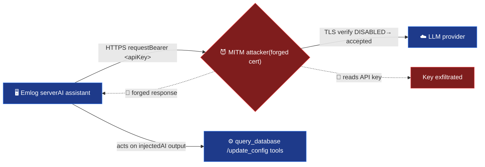

# Exploit for CVE-2026-67598

[Skip to main content](#main)

[Sploitus](/)

1. [Home](/)
2. [CVE-2026-67598](/cve/CVE-2026-67598)
3. githubexploit

# Exploit for CVE-2026-67598

githubexploit · 2026-08-06

## Description

CVE-2026-67598: Emlog Pro disables TLS verification, enabling MITM to steal API keys and inject responses.

## All known vulnerabilities by product

[Emlog Pro](/product/emlog-pro)

## CVSS 9.1 for CVE-2026-67598

9.1

HIGH SEVERITY

Version 4.0

VectorCVSS:4.0/AV:N/AC:H/AT:N/PR:N/UI:N/VC:H/SC:N/VI:H/SI:N/VA:N/SA:N

Attack Vector:NETWORK

Attack Complexity:HIGH

Attack Requirements:NONE

Privileges Required:NONE

User Interaction:NONE

## Working code

68%confidence this exploit runs

Based on 2 file(s) in the source

## EPSS Score

0.2%higher than 5.9% of all CVEs

Updated 2026-08-06

## CVE Information

[CVE-2026-67598](/cve/CVE-2026-67598)

## Exploit Details

Modified:2026-08-06 10:38

Last Seen:2026-08-06 10:50

Reporter:IlhomjonR

Last commit:2026-08-06

## Tags

emlog procertificate validationman in middleapi key theftai response injectionoutbound requestsai provider

## Exploit Code

README190 lines

WrapSize Copy

```
## https://sploitus.com/exploit?id=B32118D3-7BF5-5FBA-986A-AE3578B67D05
CVE-2026-67598
Emlog Pro — Disabled TLS Certificate Validation in the AI Assistant
Network-adjacent MITM → LLM-provider API-key theft &amp; AI-response injection

  Summary ·
  Attack Flow ·
  Affected Code ·
  Proof ·
  Remediation ·
  Timeline ·
  References

---

## 📋 At a glance

| | |
|---|---|
| **CVE ID** | [CVE-2026-67598](https://vulners.com/cve/CVE-2026-67598) |
| **Product** | [`emlog/emlog`](https://github.com/emlog/emlog) — Emlog Pro |
| **Affected** | Emlog Pro **through 2.6.23** |
| **Weakness** | CWE-295: Improper Certificate Validation |
| **CVSS v4.0** | **9.1 — Critical** |
| **CVSS v3.1** | 7.4 — High |
| **Vector** | Network-adjacent · No privileges · MITM |
| **CNA** | VulnCheck · GHSA-hf85-99vj-m4c5 |
| **Reserved / Published** | 2026-07-29 / 2026-08-03 |
| **Researcher** | [Ilhomjon Rustamov (@IlhomjonR)](https://github.com/IlhomjonR) |

---

## 🔎 Summary

Emlog Pro ships an admin-facing **AI assistant** (`admin/ai.php` + `include/service/ai.php`)
that makes outbound HTTPS calls to a configured LLM provider — chat, streaming, image
generation — plus a Bing-scraping helper for the `@em-help` command.

**Every** outbound request helper unconditionally disables TLS certificate validation:

```php
curl_setopt($ch, CURLOPT_SSL_VERIFYPEER, false);
curl_setopt($ch, CURLOPT_SSL_VERIFYHOST, false);
```

Verification is off **regardless** of the configured provider URL or network path, so any
**network-adjacent / man-in-the-middle attacker** sitting between the Emlog server and the
`api_url` can transparently intercept the TLS session with a forged certificate and:

- 🔑 **Steal the `Authorization: Bearer ` header** — the site's paid LLM-provider API key.
- 💉 **Inject a malicious AI response** back into the assistant, which drives an LLM that holds
  `query_database` and `update_config` tool access.

This is a pure transport-security defect — it is **not** gated behind the AI tool-calling
confirmation UI.

---

## 🧭 Attack Flow



---

## 💥 Impact

- **API-key disclosure** — theft and financial abuse of the site's paid LLM-provider key.
- **Response injection** — attacker-controlled content enters the AI assistant's stream.
- **Low bar to exploit** — any network-adjacent position (shared hosting, hostile Wi-Fi,
  compromised router, malicious egress proxy) is enough; **no credentials** on the Emlog
  install are required.

---

## 📂 Affected Code

`include/service/ai.php` — the `CURLOPT_SSL_VERIFYPEER` / `CURLOPT_SSL_VERIFYHOST` calls in:

| Function | Purpose |
|---|---|
| `send()` | LLM chat request |
| `sendStream()` | Streaming chat response |
| `sendImageRequest()` | AI image generation |
| `fetchSearchHtml()` | Bing scrape for `@em-help` |

---

## 🧪 Proof / Verification

```bash
# 1. Configure the AI assistant with any OpenAI-compatible provider URL + API key.
# 2. Put a MITM proxy with an UNTRUSTED CA between Emlog and the provider:
mitmproxy --mode reverse:https://api.provider.example -p 8443

# 3. Trigger any AI chat / image-gen / @em-help request from the admin panel.
# 4. Result: request succeeds despite the untrusted cert, and the
#    "Authorization: Bearer ..." header is readable in the proxy log
#    → certificate validation is confirmed disabled.
```

📸 Tested instance (screenshots)

Screenshots of the audited Emlog Pro `2.6.23` instance live in
[`screenshots/`](./screenshots) — home page and admin login.

---

## 🛠️ Remediation

Enable TLS verification for **all** outbound calls in `include/service/ai.php`:

```diff
- curl_setopt($ch, CURLOPT_SSL_VERIFYPEER, false);
- curl_setopt($ch, CURLOPT_SSL_VERIFYHOST, false);
+ curl_setopt($ch, CURLOPT_SSL_VERIFYPEER, true);
+ curl_setopt($ch, CURLOPT_SSL_VERIFYHOST, 2);
```

> Self-hosted / OpenAI-compatible endpoints with a private CA should be supported via a
> custom CA bundle (`CURLOPT_CAINFO`) — **never** by disabling verification globally.

---

## 🔗 Related note (same feature, separate hardening)

While auditing the same AI feature, `Ai::queryDatabase()` was found to specially block direct
SQL writes to the `blog` table but **not** the `user` table (which holds `role` / `password`).
Combined with the indirect-prompt-injection path via `@em-help` (live Bing results + scraped
FAQ fed into a model that has `query_database` / `update_config` tool access), this is worth
hardening by routing `user` / `options` writes through narrowly-scoped tools — the way
`write_article` already handles blog posts. Full details in **[REPORT.md](./REPORT.md)**
(tracked separately from the CVE above).

---

## 🗓️ Timeline

| Date | Event |
|---|---|
| **2026-07-24** | Vulnerability identified during audit of Emlog Pro `2.6.23` (commit `ff5637e`) |
| **2026-07-29** | CVE reserved via VulnCheck |
| **2026-08-03** | CVE-2026-67598 published |

---

## 📚 References

- 🆔 **CVE Record** — https://vulners.com/cve/CVE-2026-67598
- 🛡️ **NVD** — https://nvd.nist.gov/vuln/detail/CVE-2026-67598
- 📢 **GitHub Advisory** — GHSA-hf85-99vj-m4c5
- 📦 **Vendor** — https://github.com/emlog/emlog
- 📝 **Full write-up** — [REPORT.md](./REPORT.md)

---

  Published for educational and defensive-security purposes as part of coordinated disclosure.
  Discovered &amp; reported by Ilhomjon Rustamov (@IlhomjonR) · CNA: VulnCheck
```

## Share

Share this link: Copy Link

### Share on social media:

[API](/api)•[X](https://x.com/sploitus_com)•[RSS](https://sploitus.com/rss)•[Atom](https://sploitus.com/atom)

powered by

 [](https://vulners.com)

All product names, logos, and brands are property of their respective owners. All company, product and service names used in this website are for identification purposes only. Use of these names, logos, and brands does not imply endorsement.

