# hyperlight-overlaybd-poc exploit

[Skip to main content](#main)

[Sploitus](/)

1. [Home](/)
2. githubexploit

# Exploit for hyperlight-overlaybd-poc

githubexploit · 2026-08-12

## Description

PoC mounts job output as immutable content-addressed overlaybd layer on another host without containerd or Kubernetes.

## CVSS Score

5.7

MEDIUM SEVERITY

Version NONE

VectorNONE

## Working code

96%confidence this exploit runs

Based on 17 file(s) in the source

## Exploit Details

Modified:2026-08-12 23:41

Last Seen:2026-08-12 23:50

Reporter:juliusl

Written in:Python

Last commit:2026-08-12

## Tags

hyperlight-sandboxoverlaybdsandbox escapecontent-addressed layermicro-VM isolation

## Exploit Code

README504 lines

WrapSize Copy

```
## https://sploitus.com/exploit?id=66B2B8B7-FAEE-525B-B226-83FB4EB7556C
# hyperlight-overlaybd-poc

**Can the output of a sandboxed job become an immutable, content-addressed
filesystem layer that a *different machine* mounts straight out of a registry —
with no containerd, no Kubernetes, and without ever downloading the layer?**

This is a proof of concept that answers yes, and shows where the seams are.

## The idea

Two pieces of technology that normally live in different worlds:

- **[hyperlight-sandbox](https://github.com/hyperlight-dev/hyperlight-sandbox)**
  runs untrusted code inside a micro-VM. The isolation boundary is a
  hypervisor, not a namespace. A job gets a read-only `/input`, a writable
  `/output`, and nothing else — no network, no host filesystem.
- **[overlaybd](https://github.com/containerd/overlaybd)** presents a stack of
  OCI layers as a block device. Layers are content-addressed blobs, the device
  is a real `/dev/sdX`, and a *remote* layer is range-read from the registry on
  demand rather than pulled and unpacked first.

Put them together and a job's output directory stops being a directory. It
becomes a **layer**: an immutable, content-addressed artifact that a registry
can store, another machine can mount, and nothing downstream can modify.

That is the entire claim. The PoC exists to find out what breaks on the way
there — and something always does.

## Phase 1: one host

```mermaid
%%{init: {"flowchart": {"wrappingWidth": 340}}}%%
flowchart LR
    subgraph JOB1["job 1 — produce"]
        direction TB
        J1["job 1 sandbox (micro-VM)/input (ro) · /output (rw)"]
        MA["/mnt/obd-aext4, mounted rw"]
        SDX["/dev/sdXTCMU + tcm_loop"]
        DA["device Alower: ext4_64 baselayerupper: sparse writable layer (rw)"]
        J1 -->|"writes /output"| MA
        MA --> SDX
        SDX --> DA
    end

    subgraph JOB2["job 2 — consume"]
        direction BT
        DB["device Blower 1: ext4_64 baselayerlower 2: job1-layer.commit (ro)"]
        SDY["/dev/sdYTCMU + tcm_loop"]
        MB["/mnt/obd-bext4, mounted ro,noload"]
        J2["job 2 sandbox (micro-VM)/input (ro) · /output (temp)"]
        DB --> SDY
        SDY --> MB
        MB -->|"immutable /input"| J2
    end

    DA -->|"overlaybd-commit(device torn down first)"| DB
```



Job 1 writes its results to `/output`. That directory is ext4 on an overlaybd
device whose upper layer is sparse and writable. When the job finishes, the
orchestrator unmounts, tears the device down, and commits that upper layer into
a read-only overlaybd layer.

A second device then stacks the committed layer as a *lower* and hands it to
job 2 as `/input`. Job 2 can read every byte job 1 produced and cannot change
any of it — writes to `/input` fail with `PermissionError` inside the guest,
and the mount itself is read-only on the host.

## Phase 2: two hosts and a registry

Phase 1 proves the layer chain works, but both halves share a disk, which is
the easy case. Phase 2 removes the shared disk: the machine that produces the
layer and the machine that consumes it are different hosts whose only common
ground is a registry.


The low side pushes the committed layer to Azure Container Registry as an OCI
artifact. The high side resolves the tag to a blob digest and mounts that layer
**without downloading it** — overlaybd range-reads blocks over HTTP as the
filesystem asks for them.

No Kubernetes, no containerd, no `docker pull`, and no copy of the layer file
anywhere on the high side's disk. The registry is used purely as
content-addressed blob storage. Each VM authenticates with its own managed
identity, so no registry password exists anywhere.

## What the PoC does, step by step

Six stages, each runnable on its own, each ending in a PASS/FAIL banner. They
are built as a ladder: every stage adds exactly one new thing to the one below
it, so when something breaks you already know what introduced it.

### Stage 0 — preflight

Read-only checks with actionable failure messages: kernel modules, configfs,
`/dev/kvm`, the overlaybd daemon, the binaries, and whether the Python SDK
actually imports. The only stage that runs without root.

Requirements that just the sandbox stages need are reported separately, so a
host that cannot run Hyperlight still gets a clean bill of health for the
overlaybd half instead of a wall of red.

### Stage 1 — the sandbox, alone

No overlaybd at all. An input directory round-trips into the guest as
read-only `/input`, the guest writes to `/output`, and the files land on the
host.

**What it proves:** the sandbox half works over ordinary directories, so
anything that breaks later is the block device, not the micro-VM. It also pins
down one surprise: `/output` is wiped at the start of *every* `run()`, which is
why the PoC never points `output_dir` at a mount root.

### Stage 2 — overlaybd, alone

No sandbox. Device A is a baselayer plus a sparse writable layer, mounted rw. A
marker file is written as root, then the device is unmounted, torn down, and
committed. Device B stacks the committed layer and mounts it read-only.

**What it proves:** the write → commit → reuse-as-lower chain holds on its own.
If the marker shows up on device B and writes to device B are refused, the
layer mechanics are sound before a sandbox is ever involved.

### Stage 3 — the whole pipeline

Stages 1 and 2 wired together, in the order that actually works:

1. Create the sparse writable layer. Sparse matters — the default
   log-structured layer is append-only and tuned for image conversion, not for
   a job creating and deleting files.
2. Launch device A over configfs, mount it rw, and create the job's output
   directory *inside* the mount rather than at its root.
3. Construct sandbox 1 **after** the mount exists, and run job 1. It reads
   `/input/seed.json` and writes `result.json`, `notes.txt` and
   `manifest.json`.
4. Verify the files on the host, then **drop the sandbox object**, sync,
   unmount, and tear device A down completely.
5. Commit the writable layer — only once the device is gone.
6. Launch device B with the committed layer as a lower and no upper, mounted
   `ro,noload`.
7. Run job 2 with device B as its `/input`. It re-derives job 1's checksum,
   prints something derived from it, and **asserts that writing to `/input`
   fails**.

**What it proves:** job 2's input...