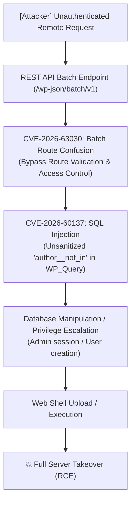

# Exploit for SQL Injection in Wordpress

[Skip to main content](#main)

[Sploitus](/)

1. [Home](/)
2. CVE-2026-60137 · githubexploit

# Exploit for SQL Injection in Wordpress

[CVE-2026-60137](/cve/CVE-2026-60137)[CVE-2026-63030](/cve/CVE-2026-63030)

githubexploit · 2026-08-19

## Description

Unauthenticated RCE chain exploits REST API batch confusion and author\_\_not\_in SQLi in WordPress 6.8.0-7.0.1.

## Entry point

Parameterauthor\_\_not\_in · request body

Pathbatch/v1

WordPress REST API batch routing confusion with SQL injection enabling unauthorized admin creation and potential RCE (CVE-2026-63030).

## Affected Wordpress versions

Wordpress< 6.8.6, 6.9.5, 7.0.2

## All known vulnerabilities by product

[Wordpress](/product/wordpress)

## CVSS Score

9.8

HIGH SEVERITY

Version 3.1

VectorCVSS:3.1/AV:N/AC:L/PR:N/UI:N/S:U/C:H/I:H/A:H

Attack Vector:NETWORK

Attack Complexity:LOW

Privileges Required:NONE

User Interaction:NONE

Scope:UNCHANGED

Confidentiality:HIGH

Integrity:HIGH

Availability:HIGH

## Working code

97%confidence this exploit runs

Based on 1 file(s) in the source

## EPSS Score

95.6%higher than 99.9% of all CVEs

Updated 2026-08-19

## Exploit Details

Modified:2026-08-19 08:42

Last Seen:2026-08-19 08:50

Reporter:TranDongA3

Last commit:2026-08-19

## Tags

WordPressSQL InjectionUnauthenticated RCECVE-2026-63030CVE-2026-60137

## Other exploits for the same CVE

[wp2shell-Exploit-Waf-Bypass

2026-08-13 interim-embryoniccell971GITHUB](/exploit?id=150C3C61-7381-546D-9390-B5927A9D73AA)[Exploit for SQL Injection in Wordpress

2026-08-08 M4xSecGITHUB](/exploit?id=497286E1-C7A5-56E6-945B-5EA4822F5C75)[📄 WordPress WP2Shell SQL Injection / Remote Code Execution

2026-08-07 haongo, Adam Kues, dtro, TF1T, Crypto-CatPACKETSTORMRuby](/exploit?id=PACKETSTORM:228094)[Exploit for SQL Injection in Wordpress

2026-08-05 DungsocoolGITHUB](/exploit?id=1D3DE74C-F46C-52E6-92E0-B71E0937D47A)[Exploit for Interpretation Conflict in Wordpress

2026-08-05 sowarmaGITHUB](/exploit?id=55B5F267-6EB7-5AEA-8621-0512C18C551B)[Exploit for Interpretation Conflict in Wordpress

2026-08-05 AnggaTechIGITHUB](/exploit?id=EC2B25A4-889A-5D7C-9793-6DABDD56AEF6)[Exploit for SQL Injection in Wordpress

2026-08-05 AbdullahMaqbool22GITHUB](/exploit?id=4B54375C-1816-523D-BEE3-4FB0CF80DB78)[Exploit for Interpretation Conflict in Wordpress

2026-08-04 rechandraGITHUB](/exploit?id=EAD3091E-D6DE-595F-BECF-235A06F58FB5)

## Exploit Code

README98 lines

WrapSize Copy

```
## https://sploitus.com/exploit?id=7076751D-E0A6-5B34-B317-22578F66EFD3
# PoC: WP2Shell — CVE-2026-63030 & CVE-2026-60137

---

## 📌 Tổng quan (Overview)

**WP2Shell** là chuỗi khai thác lỗ hổng nghiêm trọng (Exploit Chain) trong mã nguồn **WordPress Core**, cho phép kẻ tấn công từ xa **không cần xác thực (Unauthenticated Remote Attacker)** chiếm quyền điều khiển hoàn toàn máy chủ (**Full Server Takeover / RCE**).

Chuỗi khai thác kết hợp hai lỗ hổng bảo mật:
1. **CVE-2026-63030 (REST API Batch Route Confusion):** Xung đột phân giải endpoint trong WordPress REST API batch handler, cho phép request được xác thực theo một route nhưng thực thi ở route khác, vượt qua cơ chế kiểm tra quyền truy cập (Authentication / Route Validation Bypass).
2. **CVE-2026-60137 (SQL Injection in `WP_Query`):** Lỗi xử lý thiếu lọc đầu vào (Sanitization) đối với tham số `author__not_in` trong `WP_Query`, dẫn đến SQL Injection.

Khi xâu chuỗi hai lỗ hổng này, attacker có thể gửi HTTP request đặc chế tới `/wp-json/batch/v1`, vượt qua cơ chế xác thực và kích hoạt SQLi để leo thang đặc quyền, tạo shell và thực thi mã tùy ý từ xa (**RCE**).

---

## 📊 Thông tin lỗ hổng (Vulnerability Details)

| Thuộc tính | Chi tiết |
| :--- | :--- |
| **Tên mã khai thác (Chain Name)** | **WP2Shell** |
| **CVE IDs** | **CVE-2026-63030** & **CVE-2026-60137** |
| **Mức độ nghiêm trọng (Severity)** | **Critical** (CVSS v3.1: 9.8 / 10.0) |
| **Vector tấn công (Attack Vector)** | Network (Unauthenticated Remote) |
| **Phiên bản bị ảnh hưởng (Affected Versions)** | • **Full RCE Chain:** WordPress `6.9.0` - `6.9.4` & `7.0.0` - `7.0.1`• **SQL Injection Only:** WordPress `6.8.0` - `6.8.5` |
| **Phiên bản đã vá (Patched Versions)** | WordPress **6.8.6**, **6.9.5**, **7.0.2** |

---

## 🎬 Video Demo Proof-of-Concept (PoC Video)

Video ghi lại toàn bộ quá trình tái hiện và khai thác thực tế được lưu trữ trên Google Drive:

🔗 **Link xem / tải video PoC:** [Google Drive - Video Demo WP2Shell PoC](https://drive.google.com/drive/folders/1MZ9f6LV7d1hM_Q_yg1hCfXa9NSqXR407?usp=sharing)

---

## 📖 Tài liệu phân tích kỹ thuật chi tiết (Detailed Writeup)

Toàn bộ luồng phân tích kỹ thuật, từng bước tái hiện PoC và giải thích mã nguồn được lưu trữ tại Notion:

🔗 **Link bài viết Notion:** [Luồng POC CVE WP2Shell (Notion Writeup)](https://app.notion.com/p/Lu-ng-POC-CVE-WP2Shell-3baeac4f73068063a839ce5519ea5374?source=copy_link)

---

## ⚙️ Sơ đồ chuỗi khai thác (Exploitation Flow)



---

## 🛡️ Biện pháp khắc phục & Phòng ngừa (Mitigation)

1. **Cập nhật ngay lập tức:** Nâng cấp WordPress Core lên phiên bản an toàn:
   - Nhánh 6.8.x: cập nhật lên **WordPress 6.8.6**
   - Nhánh 6.9.x: cập nhật lên **WordPress 6.9.5**
   - Nhánh 7.0.x: cập nhật lên **WordPress 7.0.2**
2. **Cấu hình WAF / Web Server:**
   - Tạm thời chặn hoặc kiểm soát chặt chẽ các truy vấn tới endpoint `/wp-json/batch/v1` từ người dùng chưa xác thực nếu chưa thể cập nhật ngay.
3. **Rà soát máy chủ (Forensics):**
   - Kiểm tra log web server tìm kiếm các request bất thường gửi tới `/wp-json/batch/v1`.
   - Quét thư mục `wp-content/uploads/` và `wp-content/plugins/` để phát hiện web shell hoặc file lạ.

---

## ⚠️ Tuyên bố từ chối trách nhiệm (Disclaimer)

> [!WARNING]
> Tài liệu và mã nguồn PoC này chỉ phục vụ mục đích **nghiên cứu bảo mật, giáo dục và phòng thủ hệ thống**.
> Tác giả không chịu bất kỳ trách nhiệm nào đối với việc sử dụng trái phép các thông tin hoặc công cụ trong repository này để tấn công các hệ thống mà bạn không có thẩm quyền hợp pháp.
```

## Share

Share this link: Copy Link

### Share on social media:

[API](/api)•[X](https://x.com/sploitus_com)•[RSS](https://sploitus.com/rss)•[Atom](https://sploitus.com/atom)

powered by

 [](https://vulners.com)

All product names, logos, and brands are property of their respective owners. All company, product and service names used in this website are for identification purposes only. Use of these names, logos, and brands does not imply endorsement.

