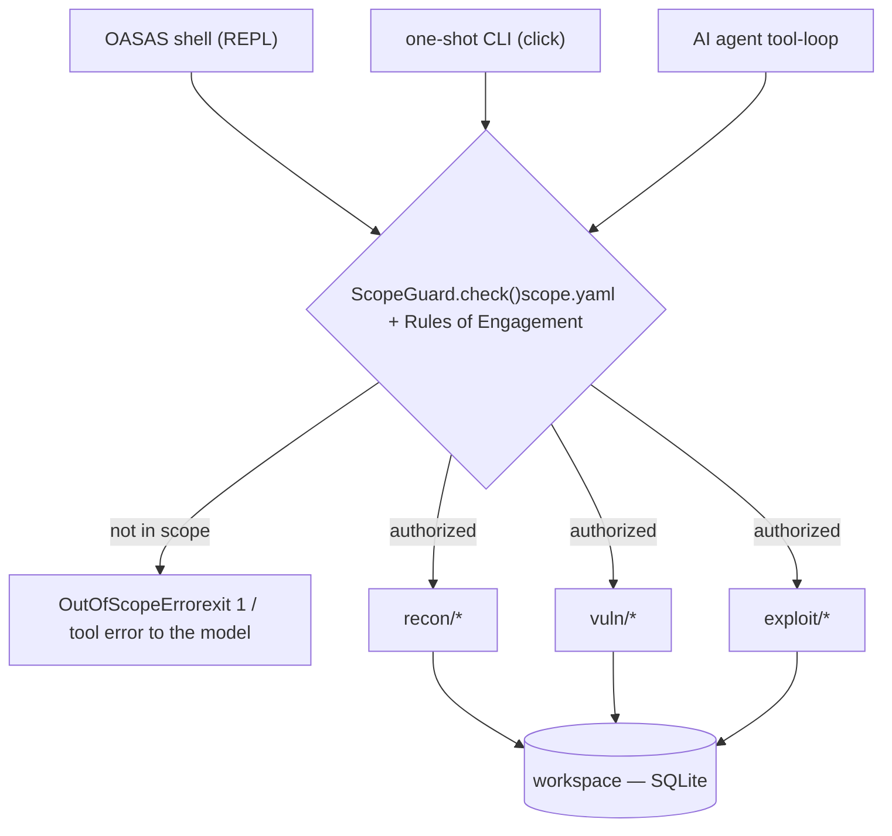
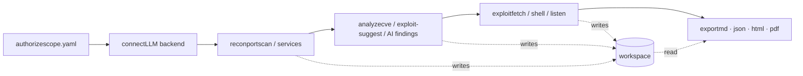

# OASAS exploit

[Skip to main content](#main)

[Sploitus](/)

1. [Home](/)
2. githubexploit

# Exploit for OASAS

githubexploit · 2026-08-19

## Description

OASAS is a Python 3.9+ pentest toolkit with scope-gated recon, CVE-to-PoC pipeline, and AI backend integration.

## CVSS Score

6.3

MEDIUM SEVERITY

Version NONE

VectorNONE

## Working code

100%confidence this exploit runs

Based on 50 file(s) in the source

## Exploit Details

Modified:2026-08-19 13:02

Last Seen:2026-08-19 13:05

Reporter:akonPAPA

## Tags

OASASpentest toolkitscope gatingAI integrationreconnaissanceexploit developmentCVE intelligence

## Exploit Code

README405 lines

WrapSize Copy

```
## https://sploitus.com/exploit?id=F61E01B7-8693-58E3-99BD-4BD871C51A9C
# OASAS - Offensive Automation & Scope-Aware Suite

###  Very powerfull tool for agentic pentest and offensive security

---


---

**A single-package pentest / CTF toolkit** — recon, payload templating,
CVE→PoC exploit intelligence, and a provider-agnostic AI layer, with every
network action gated by a written authorization file.


&nbsp;
&nbsp;

Run it as an interactive shell (`python -m exploit_builder`) or as one-shot
subcommands. The AI backend is your choice: local Ollama, any OpenAI-compatible
server, or Anthropic.

```text
┌ OASAS · at a glance ─────────────────────────────────────────────┐
│  recon      portscan · services · fingerprint · dirscan · dns    │
│  vuln intel NVD CVE  ->  reference links · CWE · public PoCs     │
│  exploit    reverse shells · msfvenom · reverse-shell listener   │
│  ai         analyze · poc · chat · autonomous scope-gated agent  │
│  workspace  SQLite — hosts / findings / loot / notes persist     │
│  safety     every network action gated by config/scope.yaml      │
└──────────────────────────────────────────────────────────────────┘
```

## Contents

1. [The one rule everything hangs off](#the-one-rule-everything-hangs-off)
2. [Setup](#setup)
3. [Engagement flow](#engagement-flow)
4. [Choosing an LLM backend](#choosing-an-llm-backend)
5. [Command reference](#command-reference)
6. [Exploit intelligence pipeline](#exploit-intelligence-pipeline)
7. [Rules of Engagement](#rules-of-engagement)
8. [One-shot commands](#one-shot-commands)
9. [Project layout](#project-layout)
10. [Testing](#testing)
11. [Extending it](#extending-it)
12. [Responsible use](#responsible-use)

---

## The one rule everything hangs off

Nothing that touches a network target runs unless that target is written down
first. `config/scope.yaml` is your authorization record; `ScopeGuard` is the
single choke point every caller passes through — the shell, the one-shot CLI,
and the AI agent's own tool calls alike. An out-of-scope request comes back as
an error, never a silent bypass.



Payload *generation* (reverse shells, web-test markers, cyclic patterns, PoC
drafting) has no network side effects at all — it only produces text/code for
you to use in your own tooling, so it sits outside the gate.

---

## Setup

```bash
pip install -r requirements.txt
cp config/scope.yaml.example config/scope.yaml   # edit: your authorized targets
cp config/llm.yaml.example  config/llm.yaml      # optional: pick an LLM backend
```

`config/scope.yaml` ships authorizing only `127.0.0.1`, `localhost`, and a
sample lab CIDR. Edit it before running any active module.

---

## Engagement flow

A run walks through six stages. Recon, analysis, and exploitation all persist
into one SQLite workspace; `export` reads back whatever has accumulated there,
so you don't have to run every stage, or run them in order, for the report to be
complete.



```
$ python -m exploit_builder                 # animated intro + REPL
oasas> targets                              # what scope.yaml authorizes
oasas> connect ollama llama3.1              # wire up a local agent, no API key
oasas> workspace new lab                    # named, persistent engagement
oasas> recon 192.168.56.10 analyze          # scan + AI analysis
oasas> exploit-suggest 192.168.56.10        # services -> CVEs + links + public PoCs
oasas> export html                          # report from everything recorded
```

---

## Choosing an LLM backend

Selection precedence (highest first): CLI flags → env vars → `config/llm.yaml` →
built-in default (`anthropic` / `claude-opus-5`).

Wire a backend from inside the shell with `connect` — no environment fiddling:

| Command | Backend |
|---|---|
| `connect ollama llama3.1` | local Ollama (no API key) |
| `connect local http://localhost:1234/v1` | local OpenAI-compatible (LM Studio / llama.cpp / vLLM) |
| `connect anthropic --key sk-ant-...` | Anthropic cloud |
| `connect` · `connect test` · `connect save` | show / probe / persist the active backend |

Or from the command line and environment:

```bash
python -m exploit_builder --provider ollama --model llama3.1 recon 127.0.0.1 --analyze
python -m exploit_builder --provider openai_compatible --model gpt-4o-mini poc "..."
python -m exploit_builder providers          # show what's active
```

Environment equivalents: `EBF_PROVIDER`, `EBF_MODEL`. API keys are read from the
env var each provider expects (`ANTHROPIC_API_KEY`, `OPENAI_API_KEY`, or the
`api_key_env` you set for an OpenAI-compatible endpoint). On Windows PowerShell:

```powershell
$env:ANTHROPIC_API_KEY = "sk-ant-..."
```

The `anthropic` package is only needed for the Anthropic provider; drop it if you
run purely local / OpenAI-compatible.

---

## Command reference

### Recon

| Command | Does |
|---|---|
| `recon  [analyze] [report]` | TCP connect scan + banner grab, optional AI analysis/report |
| `services ` | service/version detection (`nmap -sV` if installed, else banner) |
| `fingerprint ` | HTTP tech + security headers + TLS cert + robots |
| `dirscan  [wordlist]` | directory/content brute-force |
| `subdomains ` · `dns ` | DNS brute-force · records + crt.sh |

### Vulnerability & exploit intelligence

| Command | Does |
|---|---|
| `cve  [ver]` · `cve hosts` | NVD lookup for a product / all recorded services |
| `exploit-suggest ` | recorded services → CVEs + reference links + existing public PoCs |
| `exploit-suggest ` | one CVE → all reference links + live GitHub PoCs |
| `exploit-fetch [--extract] ` | mirror existing public PoCs to `reports/poc/` for review (no exec) |
| `nuclei ` · `webscan  [param]` | nuclei templates · active XSS/SQLi probe |

### Payloads & exploitation

| Command | Does |
|---|---|
| `shell   ` | render a reverse-shell one-liner |
| `web ` · `encode  ` | web-vuln markers · base64/url/hex/powershell |
| `pattern  [hex]` | cyclic pattern, or find the offset of a captured value |
| `msfvenom    [fmt] [out]` | payload generation (needs msfvenom) |
| `listen ` · `sessions` · `interact ` · `kill ` | reverse-shell handler |

### AI

| Command | Does |
|---|---|
| `poc ` | AI drafts PoC code for a vulnerability you've identified |
| `poc --from  ` | AI adapts an existing local PoC to your target |
| `chat ` | grounded,...