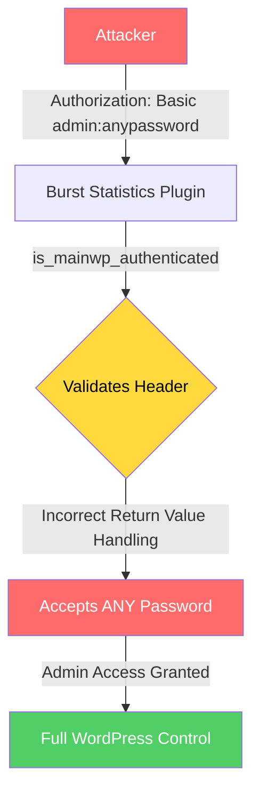

# Exploit for CVE-2026-8181

[Skip to main content](#main)

[Sploitus](/)

1. [Home](/)
2. [CVE-2026-8181](/cve/CVE-2026-8181)
3. githubexploit

# Exploit for CVE-2026-8181

githubexploit · 2026-08-20

## Description

Authentication bypass in Burst Statistics plugin versions 3.4.0 to 3.4.1.1 enables unauthenticated privilege escalation.

## CVSS 9.8 for CVE-2026-8181

9.8

HIGH SEVERITY

Version 3.1

VectorCVSS:3.1/AV:N/AC:L/PR:N/UI:N/S:U/C:H/I:H/A:H

Attack Vector:NETWORK

Attack Complexity:LOW

Privileges Required:NONE

User Interaction:NONE

Scope:UNCHANGED

Confidentiality:HIGH

Integrity:HIGH

Availability:HIGH

## Working code

100%confidence this exploit runs

Based on 3 file(s) in the source

## CVE Information

[CVE-2026-8181](/cve/CVE-2026-8181)

## Exploit Details

Modified:2026-08-20 05:02

Last Seen:2026-08-20 05:05

Reporter:0xTerror

Written in:Python

Last commit:2026-08-20

## Tags

Burst Statisticsauthentication bypassprivilege escalationunauthenticated accessWordPress pluginMainWP integration

## Other exploits for CVE-2026-8181

[Exploit for CVE-2026-8181

2026-07-14 HudzaifahArrantisiGITHUB](/exploit?id=35938F5F-C72C-51E3-AFD2-C7F42940C343)[Exploit for CVE-2026-8181

2026-06-25 SquamityGITHUB](/exploit?id=0C4729E1-C052-58C7-867B-EA946316B6B4)[📄 WordPress Burst Statistics 3.4.1.1 Authentication Bypass

2026-06-08 indoushkaPACKETSTORM](/exploit?id=PACKETSTORM:222846)[Exploit for CVE-2026-8181

2026-05-22 BastianXploitedGITHUB](/exploit?id=E9A1482E-E5BA-5F76-8D6C-73AA750FE944)[Exploit for CVE-2026-8181

2026-05-22 YucaerinGITHUB](/exploit?id=522B1603-6593-5EFB-BAA4-98CDE9B1D859)[Exploit for CVE-2026-8181

2026-05-17 rootdirective-secGITHUB](/exploit?id=95B9E42C-CF18-58D5-AD11-6D4AE64471D3)[Exploit for CVE-2026-8181

2026-05-17 xShadow-HereGITHUB](/exploit?id=300A3F87-96E3-5A9A-BC5B-46F2890EF41B)[Exploit for CVE-2026-8181

2026-05-16 whattheslimeGITHUB](/exploit?id=63C1AEEC-D5CC-5F18-BFC5-26EBEA776153)

## Exploit Code

README105 lines

WrapSize Copy

```
## https://sploitus.com/exploit?id=8322E547-AFB5-561F-95D8-C504EB54EF91
# 💥 CVE-2026-8181 - Burst Statistics Authentication Bypass

  ### Unauthenticated Privilege Escalation via MainWP Authentication Bypass

  [](https://github.com/0xTerror/CVE-2026-8181-Burst-Statistics-Auth-Bypass/stargazers)
  [](https://github.com/0xTerror/CVE-2026-8181-Burst-Statistics-Auth-Bypass/network/members)
  [](LICENSE)
  [](https://www.python.org/)
  [](https://wordpress.org/)

---

## 👨‍💻 Author

  ### 0xTerror
  **Security Researcher | Exploit Developer | Bug Hunter**

  [](https://github.com/0xterror)
  [](https://twitter.com/0xterror)

---

## 📋 Table of Contents

- [Overview](#-overview)
- [What Makes It Vulnerable](#-what-makes-it-vulnerable)
- [Affected Versions](#-affected-versions)
- [Technical Analysis](#-technical-analysis)
- [Exploitation Steps](#-exploitation-steps)
- [Features](#-features)
- [Installation](#-installation)
- [Usage](#-usage)
- [Example Output](#-example-output)
- [Detection & Mitigation](#-detection--mitigation)
- [Disclaimer](#-disclaimer)
- [License](#-license)

---

## 📋 Overview

**CVE-2026-8181** is a critical **Authentication Bypass** vulnerability in the **Burst Statistics** WordPress plugin (versions `3.4.0` - `3.4.1.1`). This flaw allows an **unauthenticated attacker** to impersonate any administrator by exploiting incorrect return-value handling in the `is_mainwp_authenticated()` function when validating application passwords from the Authorization header.

### ⚡ Quick Facts

| Fact | Details |
|------|---------|
| **CVE ID** | CVE-2026-8181 |
| **CVSS Score** | **9.8 (Critical)** |
| **Vector** | AV:N/AC:L/PR:N/UI:N/S:U/C:H/I:H/A:H |
| **Plugin** | Burst Statistics (Google Analytics Alternative) |
| **Affected Versions** | 3.4.0 – 3.4.1.1 |
| **Patched Version** | 3.4.2 |
| **Attack Type** | Authentication Bypass / Privilege Escalation |
| **Authentication Required** | ❌ None |
| **User Interaction** | ❌ None |

---

## 🔍 What Makes It Vulnerable

### Root Cause Analysis

The vulnerability exists in the `is_mainwp_authenticated()` function of the Burst Statistics plugin. The flaw is triggered by:

1. **Incorrect Return-Value Handling**: The function fails to properly validate the authentication result.
2. **Authorization Header Processing**: The plugin attempts to validate application passwords from the Authorization header.
3. **Logic Flaw**: Any random password supplied with a valid administrator username will be accepted.

### Technical Breakdown

| Aspect | Details |
|--------|---------|
| **Component** | `is_mainwp_authenticated()` function |
| **File** | `burst-statistics/classes/mainwp/class-burst-mainwp.php` |
| **Vulnerability Type** | CWE-287: Improper Authentication |
| **Attack Vector** | HTTP Request with Authorization Header |
| **Authentication** | ❌ None required |
| **Privilege** | Administrator (full WordPress control) |

### Attack Flow Diagram



## Share

Share this link: Copy Link

### Share on social media:

[API](/api)•[X](https://x.com/sploitus_com)•[RSS](https://sploitus.com/rss)•[Atom](https://sploitus.com/atom)

powered by

 [](https://vulners.com)

All product names, logos, and brands are property of their respective owners. All company, product and service names used in this website are for identification purposes only. Use of these names, logos, and brands does not imply endorsement.

