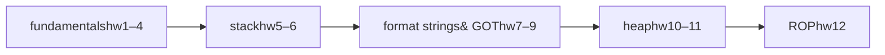

# binary-exploitation

[Skip to main content](#main)

[Sploitus](/)

1. [Home](/)
2. githubexploit

# binary-exploitation

githubexploit · 2026-08-20

## Description

Twelve C program and Unix binary exploitation homeworks covering stack, format string, heap, and ROP techniques on 32-bit x86 Linux.

## CVSS Score

N/A

NO SCORE

VectorNONE

## Working code

96%confidence this exploit runs

Based on 3 file(s) in the source

## Exploit Details

Modified:2026-08-20 21:02

Last Seen:2026-08-20 21:05

Reporter:Elnimo-00

Last commit:2026-08-20

## Tags

buffer overflowstack smashingformat stringheap exploitationreturn-oriented programminggdb pwndbg32-bit x86

## Exploit Code

README68 lines

WrapSize Copy

```
## https://sploitus.com/exploit?id=BCA55A1A-E60E-59AC-947E-EA5464CC80DB
# binary exploitation

the full set of twelve homework assignments from enpm691 — hacking of c programs
and unix binaries — collected in one place. the course runs from how c uses
memory up through defeating modern exploit mitigations, all on 32-bit x86 linux
with gdb and pwndbg.

this repo is the index and analysis. each report pdf holds the real work — c
source, disassembly, gdb/pwndbg sessions, payloads and results; the summaries
here say what each one covers and how the sequence builds.

**author:** nimal kurien thomas · university of maryland

## the arc



memory basics → taking control of the stack → abusing format strings and the got
→ corrupting the heap → and finally return-oriented programming to get around a
non-executable stack.

## the twelve assignments

| # | assignment | technique |
| --- | --- | --- |
| [1](pdfs/hw01.pdf) | c data types, addresses and sizes | memory fundamentals |
| [2](pdfs/hw02.pdf) | from c to assembly | reading compiler output |
| [3](pdfs/hw03.pdf) | memory segments and variable storage | process memory layout |
| [4](pdfs/hw04.pdf) | gdb scripting and pwndbg automation | debugger automation |
| [5](pdfs/hw05.pdf) | stack smashing | stack buffer overflow |
| [6](pdfs/hw06.pdf) | stack overflow to a root shell | privilege escalation |
| [7](pdfs/hw07.pdf) | format-string exploitation | format string + got overwrite |
| [8](pdfs/hw08.pdf) | overflow to eip control and a shell | ret2libc / `system("/bin/sh")` |
| [9](pdfs/hw09.pdf) | plt, got and dynamic linking | got manipulation |
| [10](pdfs/hw10.pdf) | use-after-free and double-free | heap exploitation |
| [11](pdfs/hw11.pdf) | dangling-pointer access-control bypass | heap exploitation |
| [12](pdfs/hw12.pdf) | return-oriented programming | rop chain → `execve("/bin/sh")` |

a fuller per-assignment write-up is in [`docs/notes.md`](docs/notes.md), and the
same index in structured form is in [`assignments.yaml`](assignments.yaml).

## what's here

| | |
| --- | --- |
| [`pdfs/`](pdfs/) | the twelve reports, `hw01.pdf` … `hw12.pdf` — the real work, with evidence |
| [`docs/notes.md`](docs/notes.md) | per-assignment summary: what it covers and why it sits where it does |
| [`assignments.yaml`](assignments.yaml) | the same index, structured |

## a thread worth following

watch the mitigations. stack canaries, aslr and nx/dep get introduced as the
defences of the day and then, one assignment at a time, shown to be incomplete —
format strings and got overwrites sidestep canaries and aslr (hw7, hw9), library
reuse sidesteps injected-shellcode defences (hw8), and rop sidesteps a
non-executable stack entirely (hw12). the course is as much about the limits of
each defence as it is about the attacks.

this is coursework on a deliberately vulnerable, mitigation-light 32-bit lab
environment, for learning how these techniques work and how to defend against
them.
```

## Share

Share this link: Copy Link

### Share on social media:

[API](/api)•[X](https://x.com/sploitus_com)•[RSS](https://sploitus.com/rss)•[Atom](https://sploitus.com/atom)

powered by

 [](https://vulners.com)

All product names, logos, and brands are property of their respective owners. All company, product and service names used in this website are for identification purposes only. Use of these names, logos, and brands does not imply endorsement.

