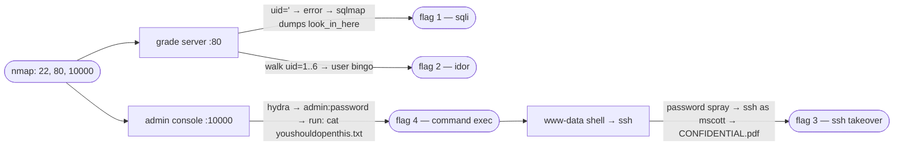

# grade-server-ctf exploit

[Skip to main content](#main)

[Sploitus](/)

1. [Home](/)
2. githubexploit

# Exploit for grade-server-ctf

githubexploit · 2026-08-20

## Description

Grade server CTF: SQLi, IDOR, default creds, command exec, and SSH takeover chain on a deliberately vulnerable university web app.

## CVSS Score

N/A

NO SCORE

VectorNONE

## Working code

97%confidence this exploit runs

Based on 3 file(s) in the source

## Exploit Details

Modified:2026-08-20 20:47

Last Seen:2026-08-20 20:50

Reporter:Elnimo-00

Last commit:2026-08-20

## Tags

grade-serversql-injectionidordefault-credentialscommand-executionssh-takeoverreverse-shell

## Exploit Code

README79 lines

WrapSize Copy

```
## https://sploitus.com/exploit?id=F57E9426-4997-53E1-AAE0-ABA5DDE02AE6
# grade server ctf

a black-box penetration test of a deliberately vulnerable web app — a university
"final grade server" — that fell through sql injection, an idor, default
credentials, and command execution, ending in a full host takeover over ssh.

this repo is the analysis: the target, the four flags, and how each one was
reached. the full engagement, with every command and screenshot, is in the
report.

**[full report (pdf)](report.pdf)** — 23 pages, every flag with terminal
evidence. the enpm685 (security tools for information security) final project,
solo, by nimal kurien thomas at the university of maryland.

## the target

a single ubuntu 22.04 vm (192.168.1.152) with three services exposed:

| port | service |
| --- | --- |
| 22 | ssh |
| 80 | http — the grade-server web app |
| 10000 | webmin / web admin console |

the web app on port 80 was the way in; port 10000 gave administrative command
execution; port 22 was the route to the final flag.

## the four flags

| flag | vulnerability | cwe | severity |
| --- | --- | --- | --- |
| 1 | sql injection in `addclasses.php?uid=` | [CWE-89](https://cwe.mitre.org/data/definitions/89.html) | critical |
| 2 | idor on the same `uid` parameter | [CWE-639](https://cwe.mitre.org/data/definitions/639.html) | high |
| 4 | default creds + command exec on the admin console | [CWE-1392](https://cwe.mitre.org/data/definitions/1392.html) | critical |
| 3 | reverse shell → ssh password spray → pdf | [CWE-522](https://cwe.mitre.org/data/definitions/522.html) | critical |

## how it chained



## what's here

| | |
| --- | --- |
| [`report.pdf`](report.pdf) | the full engagement — read this for the step-by-step with evidence |
| [`docs/walkthrough.md`](docs/walkthrough.md) | per-flag analysis: class, cwe, severity, and the fix |
| [`findings/findings.yaml`](findings/findings.yaml) | the same findings, structured |

## the short version

three of the four flags come straight out of one web app that trusts user input
in two places — a `uid` parameter spliced into a sql query (flag 1) with no
access control on it (flag 2), and an admin console left on `admin:password` that
hands user input to a shell (flag 4). the fourth (flag 3) is the cost of that
last one: the command execution became a reverse shell, a season-themed password
spray cracked ssh, and another user's home directory gave up the final flag. the
report walks through all of it; `docs/walkthrough.md` is the summary with the
remediation for each.

this was a training ctf; the target and its data are fictional.
```

## Share

Share this link: Copy Link

### Share on social media:

[API](/api)•[X](https://x.com/sploitus_com)•[RSS](https://sploitus.com/rss)•[Atom](https://sploitus.com/atom)

powered by

 [](https://vulners.com)

All product names, logos, and brands are property of their respective owners. All company, product and service names used in this website are for identification purposes only. Use of these names, logos, and brands does not imply endorsement.

